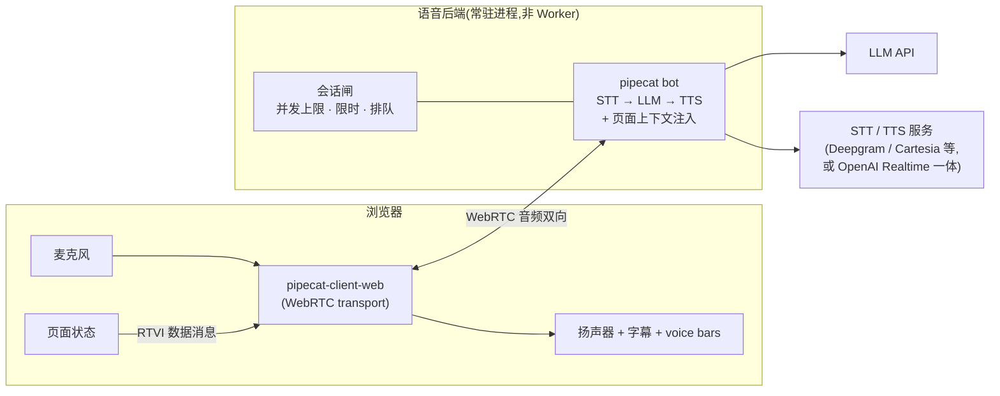

# BlackPurrl 官网 · 点子本 (IDEAS)

> 这份文档是**早期点子的收集本**,不是实施计划。
> 用来记萌芽的想法、以后可能做的方向、以及粗略的技术架构设想。
> 规则:先记想法和「为什么」,不写具体实施步骤;等某个点子真的要做了,再单开实施文档。
> README 负责「怎么跑、怎么部署」;本文件负责「以后想做成什么样」。

---

## 背景:产品北极星(便于本文件自洽)

BlackPurrl = 实时游戏陪玩 AI。玩家本机玩游戏,它本地观测游戏状态、语音陪玩;
按「Neko 需要提供什么陪伴」把游戏分成多类(长程规划 / 叙事世界观 / Build 决策 /
探索魂系 / PVP 情绪陪伴等),横切四种人设:教练、剧透分级、情绪陪伴、文化翻译。

一条状态库、多个消费方(实时语音 A、后台 coding agent B、语音操控 F 已在做;
长期记忆 C、Avatar D、蒸馏数据 E 为愿景)。设计总原则:ELT 忠实优先、数据前瞻预留。
平台聚焦 Windows PC;商业上 OSS + BYOK 起步,后叠托管 SaaS。

> 详版在 pipecat-research 仓的 research/00_strategy;这里只留一句话背景,让点子本能独立读懂。

---

## 核心方向:官网本身就是一次产品体验

BlackPurrl 的产品是「观测游戏状态、在你需要时开口的陪玩 AI」。
官网不该只是用文字介绍这件事,而应该让访客**直接被产品陪伴一遍**:

- 把「游戏状态」换成「网页状态」(滚动位置、当前 section、停留时长)。
- 把「陪玩」换成「导览」——AI 陪着访客逛官网、介绍产品。
- 访客不用读一堆文案,他体验完就知道 BlackPurrl 是干什么的。

这是一层元叙事:视频里它陪玩家打游戏,同一时刻它也在陪访客逛网站。

---

## 点子 A:网页上的 AI 陪伴体 (Companion)

页面上常驻一个陪伴体(猫 mascot + 字幕气泡 + voice bars),安静待着,
只在「对的时刻」开口——对应产品「不打扰」原则。

分两档形态,Tier 1 是 Tier 2 的子集,共享同一套底层,升级不返工:

- **Tier 1 · 文字对话**:访客打字提问,LLM 流式回答;成本延迟可控,可 24/7 常开,是每个访客都体验到的底盘。
- **Tier 2 · 真语音对话**:点按钮拉起语音会话,访客说话、AI 出声回答,可打断(full-duplex);按分钟烧钱,作为限时 demo 存在。这条管线和产品后端 v2(pipecat)是同一套技术栈,做 demo 等于反哺主线。

两档共享层:陪伴体 UI、页面状态采集器、产品知识 prompt、动作白名单执行器。

---

## 点子 B:AI 自主导航页面(原创点子,暂未见他人使用)

不是让访客自己点按钮找信息,而是**访客用一句话(语音或文字),AI 自己在页面上「走」给他看**:
自动滚动到相关 section、高亮内容、切换场景视频,边走边讲。像一个活的网站导游。

核心原理:AI 不需要「看见」或「操作」浏览器,**页面本身就是它的执行器**。
LLM 只输出结构化指令,前端 JS 按白名单执行。这与产品 F 层 Action Executor 的哲学一致:
不走视觉定位 + 模拟点击,只走结构化写通道。

设想的页面工具集(白名单):
- `scroll_to(section)` — 平滑滚动到某区块
- `highlight(element)` — 高亮/聚光某块内容
- `play_scene(n)` — 切换并播放第 n 个场景视频
- `open_panel(topic)` — 展开某个 FAQ/详情
- `say(text)` — 字幕 + TTS 说一句

AI 收到「介绍一下你们产品」,自己编排一串动作依次执行,动作之间等上一句话说完,
就形成「AI 导游带你逛页面」的效果。

自主度分三档:
1. 被动应答(默认):问一句、答一句、顺手滚到相关位置。
2. 导览模式:访客点「带我逛逛」,AI 接管,从上到下讲解整个页面。
3. 随时打断:访客一动手滚动/说话,AI 立即停下,回到被动。

**红线**:用户输入永远优先于 AI 导航。页面抢滚动条是最招人烦的体验,
这也正好呼应产品的「不打扰」原则。

加分点:访客问「你说的语音操控游戏是什么意思?」——AI 直接用语音操控页面演示给他看,
是产品能力的自指证明,也是整个设计里最有说服力的一刻。

---

## 点子 C:pi.dev 式滚动叙事首页

参考 pi.dev 的首页形态,把现有首页重做成滚动叙事(scrollytelling):

- 居中 Hero:slogan + CTA,下面紧跟一个大演示框,带「scroll to continue」提示。
- 往下滚:左侧演示框吸附(sticky),右侧三个场景章节滚动;滚到哪个章节,
  左侧就切到对应场景的视频 + 对话字幕。
- 已有素材可直接用:src/data/scenarios.ts 的三场景 + public/video/scene-0/1/2.mp4。
- 三场景对应产品能力:读实时状态 / 懂世界观(不剧透) / 记忆与情绪陪伴。

和点子 A/B 是叠加关系:三场景区是「它在游戏里的样子」,陪伴体是横切整页的
「它现在陪你的样子」,两者互相印证。

偏实施的细节(CTA 用 GitHub/Discord vs Download、视频懒加载与只播激活场景、
移动端 sticky 降级为章节内联视频)等真要做时再进实施文档,这里不展开。

---

## 粗略技术架构(设想,非定稿)

```
浏览器(静态 Astro 站)
  ├─ 陪伴体 UI(mascot / 字幕 / voice bars)
  ├─ 页面状态采集器(当前 section / 停留时长 / 已看过什么)
  └─ 动作白名单执行器(scroll_to / highlight / play_scene ...)
        │
        ├── Tier 1 ──> Cloudflare Worker(API 代理:限流 + 预算闸 + prompt 组装)──> LLM(小模型)
        │
        └── Tier 2 ──> pipecat-client-web (WebRTC) ──> 常驻语音后端(STT→LLM→TTS)
```

### Tier 2 语音数据流(较完整)



要点:
- API key 绝不进前端,Worker 是唯一出口。
- system prompt = 产品知识库微缩版(定位 / FAQ / 三场景 / principles / roadmap)+ 当前页面地图。
- 页面地图 = 网页版的 per-game catalog;导览过什么记在前端回传 = 网页版的玩家记忆。
- Tier 2 需要常驻语音后端(Pipecat Cloud 托管 或 自跑 VPS,待定)。
- 限流 / 预算闸 / 会话限时必须 day 1 就有;预算爆了语音降级文字,文字爆了降级预录剧本。

---

## 待定夺
- 语音后端选型:Pipecat Cloud 托管 vs 自跑 VPS。
- 陪伴体和「三场景滚动叙事区」怎么排版共存。
- 主动台词的触发时机与频率上限(避免烦人)。

---

## 参考 / 引用

产品愿景、消费方地图、知识三源、商业模式等长期知识,沉淀在 pipecat-research 仓:

- 仓库:https://github.com/sleepycat233/pipecat-research
- 战略库入口:research/00_strategy/VISION.md(北极星 + 战略总览索引)
- 总索引:research/README.md(调查 DAG + owner 表 + 阅读路径)
- 本地路径:../pipecat-research/research/

本文件只做官网点子的收集,不复述上面的结论;想看细节直接去 research 仓。
